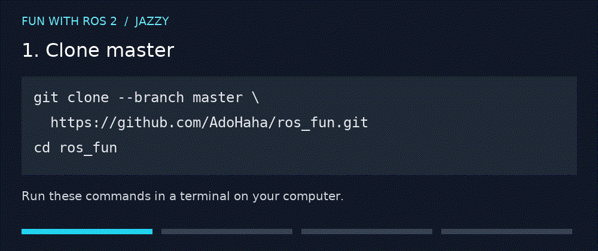

# Fun with ROS 2

Robotics is fun and ROS 2 is a must.

In this workshop, we will play around with ROS 2 and Simulating some robots

You need to have Docker and docker compose installed.
It can be docker engine:
Instructions for Ubuntu are provided [here](https://docs.docker.com/engine/install/ubuntu/)

but for beginners, an easier option might be Docker Desktop: [Windows](https://docs.docker.com/desktop/install/windows-install/) [Linux](https://docs.docker.com/desktop/install/linux-install/), [Mac](https://docs.docker.com/desktop/install/mac-install/)

 I suggest cloning this repository (you need to install [git first](https://github.com/git-guides/install-git)).

`git clone --branch master https://github.com/AdoHaha/ros_fun.git`

`cd ros_fun`

Use 

`docker compose up` to pull and run the ROS 2 Jazzy container.

Access the virtual machine screen by navigating to 

[http://localhost:6080](http://localhost:6080)

access the jupyter notebooks by navigating to:

[http://localhost:8888](http://localhost:8888) 

on your **host** machine. 

From there open [*exercises folder*](http://localhost:8888/exercises/1.%20introduction.ipynb) to access introduction

The demo uses ROS 2 Jazzy on Ubuntu 24.04.

## Autonomous planning lab

The [Robo-restaurant starter](jupyter_notebooks/robo_restaurant/README.md)
starts with numbered notebooks **12–14 in `exercises/`** and includes a Gazebo
restaurant world and demos on resources, device failures and replanning. The demos run without
ROS; connecting the planner to a navigating waiter is a later milestone.

## Maintainer image build

The workshop compose file expects a prebuilt Docker Hub image so participants do
not compile or install ROS packages locally. To publish a refreshed image, use:

`make release`

By default this builds and pushes `adohaha/fun_ros:jazzy`. Override the tag with
`make release IMAGE=adohaha/fun_ros:<tag>`.

---

[Presentation Robot Fun with ROS2 from PyCon PL](https://www.youtube.com/watch?v=K5yGKd7ig7A)
